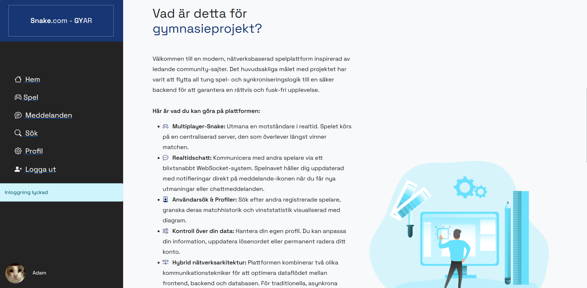
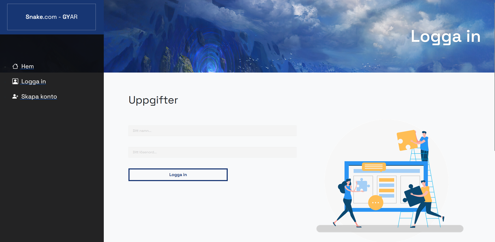
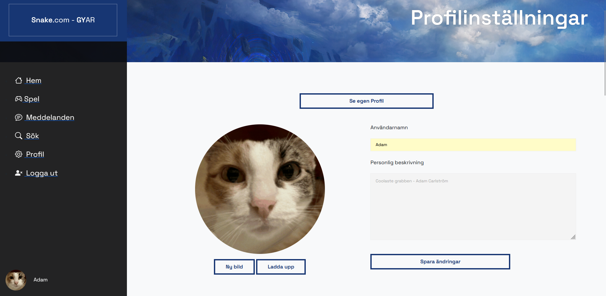
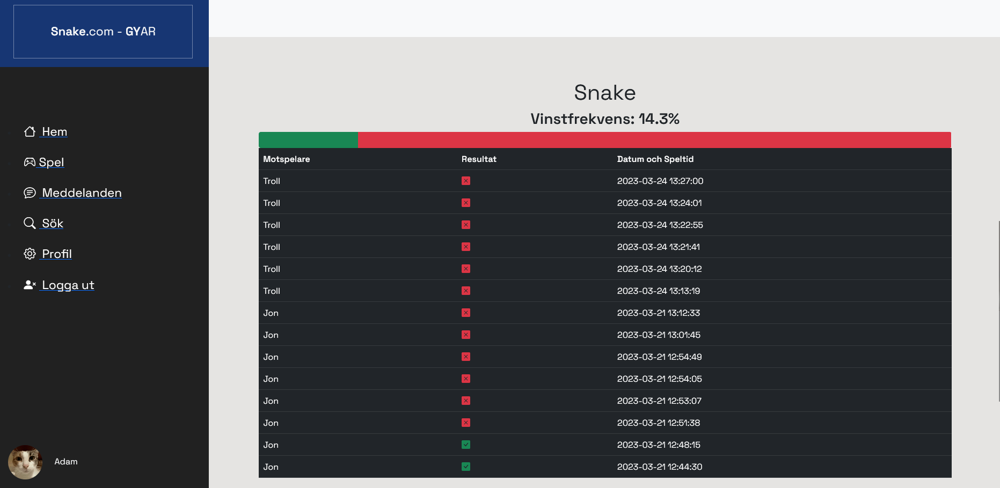
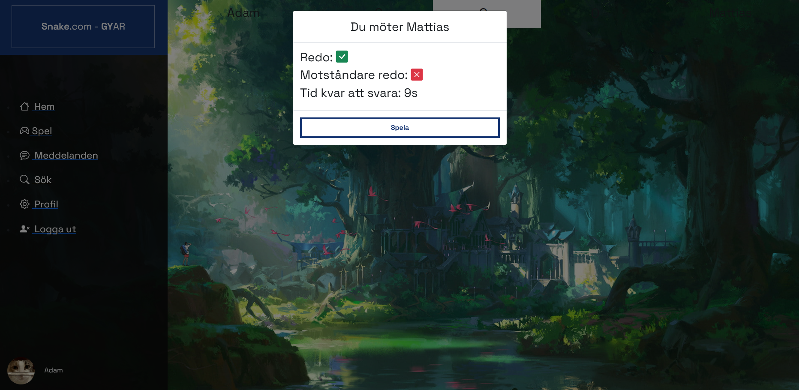
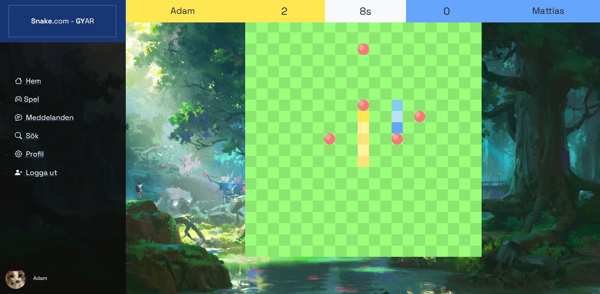
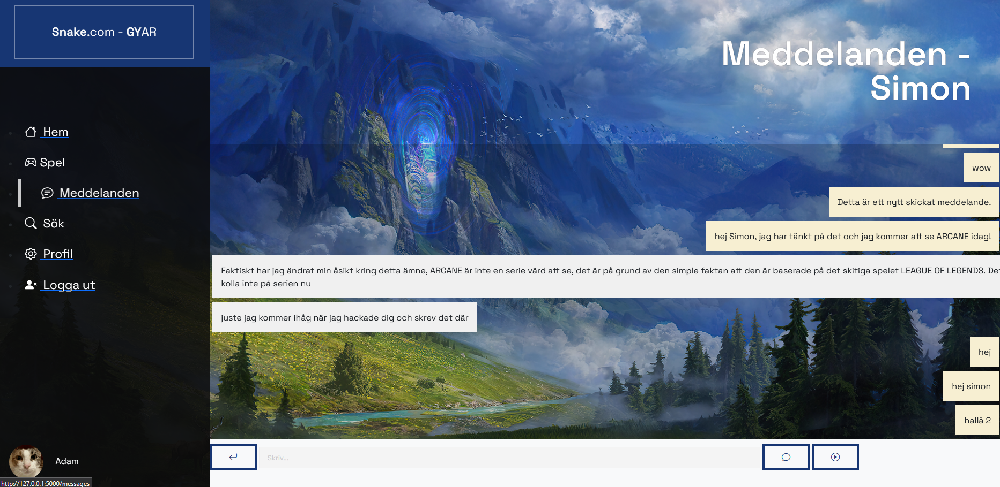

[🇸🇪 Läs på svenska](README.md)

# Multi-Snake Platform – High School Project

Welcome to a modern, network-based gaming platform inspired by leading community sites. This project is a high school diploma project (Gymnasiearbete) developed at Nacka Gymnasium (TDI20b). The primary goal of the project has been to build a robust and server-authoritative platform for real-time interaction, where all heavy game and synchronization logic has been moved to a secure backend to guarantee a fair and cheat-free experience.

---

## 🚀 Main Features

On the platform, users can interact, compete, and manage their data through multiple integrated systems:

* **Multiplayer-Snake:** Challenge an opponent in real-time. The game runs entirely on a centralized server, and the match follows a simple but competitive rule: whoever survives the longest wins.
* **Real-time Chat:** Communicate with other players via a lightning-fast WebSocket system. The game hub keeps you constantly updated with notifications directly on the message icon when you receive new challenges or chat messages.
* **User Search & Profiles:** Search for other registered players in the database, review their unique profiles, and view their match history and win statistics, which are visualized with responsive charts.
* **Control over your data:** Fully manage your own profile. You can customize your personal information, change your profile picture, update your password, or permanently delete your account.










---

## 🛠 Technical Architecture & Network

The platform combines several modern technologies to optimize resource allocation and latency, divided into a clear stack for backend and frontend.

### Hybrid Network Architecture
The system utilizes two different communication technologies to optimize data flow:
1.  **AJAX (HTTP POST):** Used for traditional, asynchronous loads (such as matchmaking in the game hub or verifying challenges). This allows the website to send and retrieve data in the background without reloading the page.
2.  **WebSockets (Socket.IO):** Once a match starts, the system switches to full-duplex communication. This persistent connection streams the players' coordinates, inputs, and the clock's seconds 10 times a second with minimal latency. The server processes this real-time data, updates the central game state, and finally saves the match result to the database via a thread-isolated execution pattern.

### Backend & Database
* **Language & Framework:** Python and Flask, structured with a Blueprint system for modular file management.
* **Database:** Relational SQLite database for fast and local data storage. Sensitive data, such as user passwords, is protected with one-way encryption (`flask-bcrypt`).
* **Security:** Server-side session management (`flask-session`) for secure user authentication.

### Frontend & Interaction
* **Rendering:** HTML5 Canvas is used to dynamically draw the game with high performance.
* **Style & Layout:** CSS3 and Bootstrap provide a responsive layout that adapts to different screen sizes.
* **Logic:** JavaScript handles the client's WebSocket connections, captures keyboard input, and updates DOM elements in real-time.

---

## 📊 Database Structure

The core of the platform's data storage consists of three main tables in SQLite that manage users, messages, and match history.

### `users` (User Accounts)
Manages all profile information and authentication data.
| Column Name | Data Type | Description |
| :--- | :--- | :--- |
| `id` | INTEGER | Primary key (Auto-increment) |
| `username` | TEXT | The user's unique display name |
| `password` | TEXT | Hashed and encrypted password |
| `description` | TEXT | The user's personal profile description |
| `profile_picture` | TEXT | Filename of the uploaded image (stored in `/uploads`) |
| `date_created` | TEXT | Date and time the account was created |

### `messages` (Real-time Chat)
Stores all communication and manages the notification system.
| Column Name | Data Type | Description |
| :--- | :--- | :--- |
| `id` | INTEGER | Primary key |
| `sender_id` | INTEGER | Foreign key (User ID of the sender) |
| `receiver_id` | INTEGER | Foreign key (User ID of the receiver) |
| `content` | TEXT | The actual message text |
| `status` | INTEGER | Indicates whether the message is read (1) or unread (0) |
| `date` | TEXT | Timestamp of when the message was sent |

### `games_history` (Match Statistics)
Saves detailed data for completed matches to generate statistics and charts.
| Column Name | Data Type | Description |
| :--- | :--- | :--- |
| `id` | INTEGER | Primary key |
| `player1_id` | INTEGER | Foreign key (Player 1 / Blue) |
| `player2_id` | INTEGER | Foreign key (Player 2 / Yellow) |
| `winner_id` | INTEGER | ID of the winner (`NULL` in case of a tie/head-on collision) |
| `score_player1` | INTEGER | Final score (number of fruits) for Player 1 |
| `score_player2` | INTEGER | Final score (number of fruits) for Player 2 |
| `duration` | INTEGER | The total length of the match measured in seconds |
| `date` | TEXT | Timestamp of when the match ended |

---

## 🛠 Installation Guide & Execution

To run the project locally on your machine, you need to have Python installed.

### 1. Install Dependencies
Install the necessary packages via the terminal:

```bash
pip install flask flask-session flask-bcrypt flask-socketio
